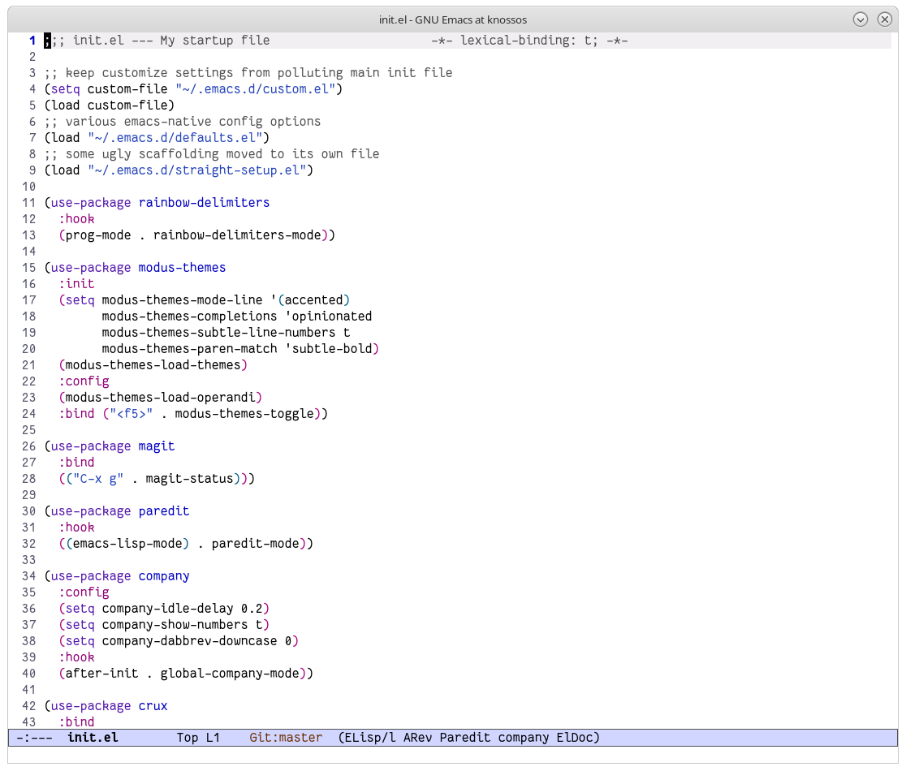

# My .emacs.d

This is my personal emacs config. My main goals were to keep startup time down, keep it snappy during everyday use, and to make it easy to manage. It's split into a few files:

- `early-init.el`
  - GC settings, adding a log to show startup performance
  - Startup time is routinely under 0.5sec on my machine
- `init.el`
  - loads most of the other files, and is where I do all my package installation/config.
- `custom.el`
  - keep settings from the customize interface here so as not to clutter the main config.
- `straight-setup.el`
  - the scaffolding code that sets up `straight.el`, it's a bit ugly so I moved it to its own file.
- `defaults.el`
  - changing built-in emacs settings (font, menu bar, scroll bar, etc.)
